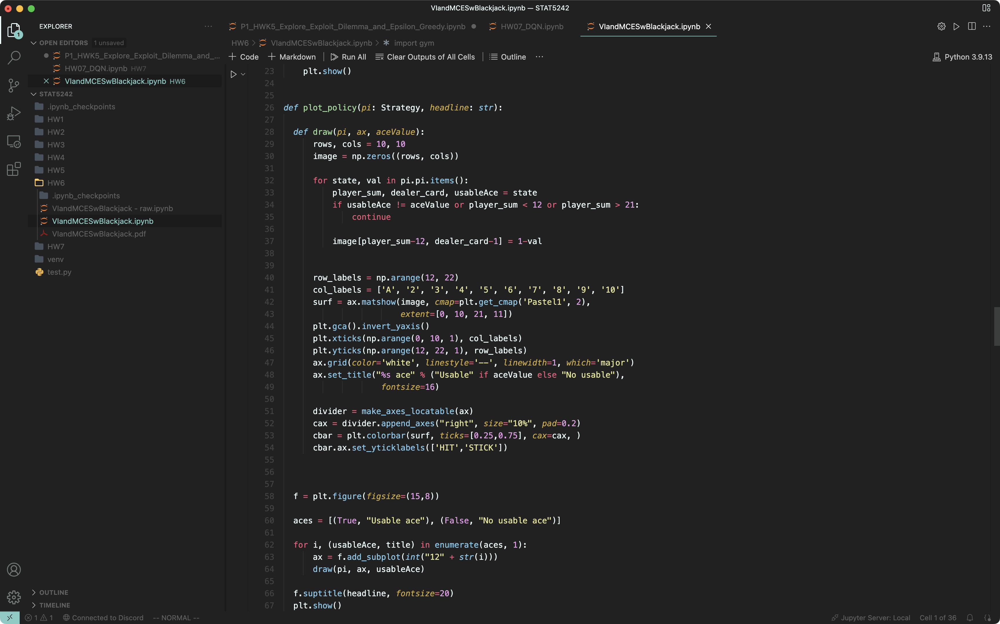

# Everything Monokai

Combination of [Monokai ST3](https://github.com/volosovich/Monokai-ST3-theme-for-vscode) syntax highlighting, and other themes (like Material).

## Material Darker + Monokai Faded

The token color is modified to better fit the theme.

## Material Darker + Monokai ST3

[Material Theme](https://github.com/material-theme/vsc-community-material-theme)

## Terminal Color Customization

[Peppermint](https://iterm2colorschemes.com)

## More themes are going to be added (hopefully...)

**Enjoy!**
